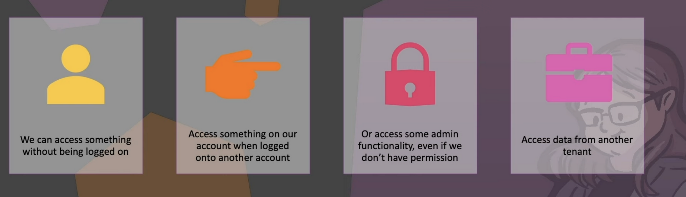
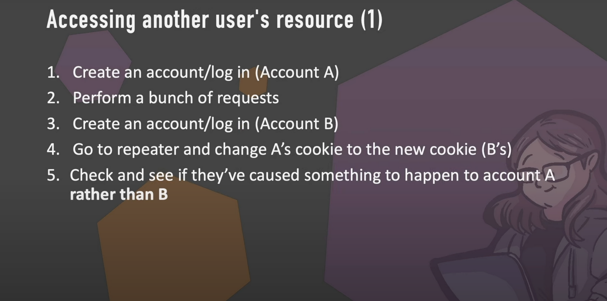

# Access Control and IDORs

Access control refers to the process of managing and regulating access to resources or information in a computer system. 

## Types of access control

- **Role-Based Access Control (RBAC):**
**Definition:** In RBAC, access rights are assigned based on roles, and individuals are assigned to these roles. Each role has specific permissions associated with it, and users inherit these permissions by being a member of a particular role.
**Example:** In an organization, there might be roles like "Manager," "Employee," and "Administrator." The Manager role could have access to certain files and systems, while the Employee role may have more restricted access. An individual's access is determined by their role within the organization.

- **Discretionary Access Control (DAC):**
**Definition:** DAC allows individual users to have discretion over their resources. Owners of resources can determine who has access to those resources and what type of access is granted.
**Example:** In a DAC system, a file owner can decide which specific users or groups have permission to read, write, or execute the file. The owner has discretionary control over the access to that particular resource and can modify these permissions.

- **Attribute-Based Access Control (ABAC):**
**Definition**: ABAC uses various attributes about the user, the resource, and the environment to make access control decisions. It considers a wide range of attributes, such as user roles, time of day, location, and other contextual information.
**Example:** ABAC might allow access to a sensitive document only if the user's role is "Manager," the document's sensitivity level is below a certain threshold, and the access request is made during regular business hours. ABAC provides a more fine-grained and context-aware approach to access control.

## IDORs
If you ask the server for a file, it won't check if you are it's owner and send it to you anyway.

We need to look for ids. they are everywhere(hidden form fields, apis, urls)

one of the ways to avoid this problem is to use uuid instead of id. however we still don't have proper access control and this method just make ids less pridictible.

## when we have a problem?

## finding issues

play with cookies

## Access Control vs IDORs

- Focus:
Access Control Attacks: Focus on exploiting vulnerabilities in the access control mechanisms of a system.
IDOR: Focus on manipulating object references (e.g., URLs, form parameters) to access unauthorized resources directly.

- Scope:
Access Control Attacks: May involve a broader range of techniques, including privilege escalation and unauthorized access.
IDOR: Specifically targets the direct manipulation of object references to access unauthorized data or resources.

- Nature of Vulnerability:
Access Control Attacks: Exploit weaknesses in the design or implementation of access control mechanisms.
IDOR: Exploit the lack of proper validation and authorization checks on user-supplied input.

In summary, while access control attacks have a broader scope, IDOR is a specific type of vulnerability where an attacker manipulates object references to access unauthorized resources. Both security issues highlight the importance of robust access controls and proper input validation in software development to prevent unauthorized access and data exposure.