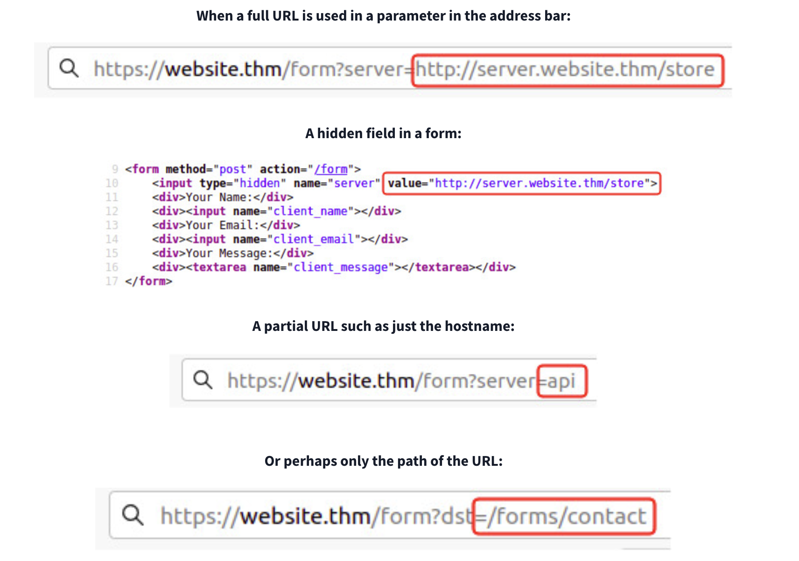

# SSRF

SSRF, or server-side request forgery, is a security vulnerability that occurs when an attacker tricks a web application into making unauthorised requests to internal or external resources on the server's behalf. This can allow an attacker to interact with internal systems, potentially leading to data exposure or unauthorised actions. Leaving web applications vulnerable to SSRF can have profound security implications, potentially leading to unauthorised access to internal systems, remote code execution (RCE), data breaches, or the application being further compromised.

## Types of SSRF Attack

- Basic: In a basic SSRF attack, the attacker sends a crafted request from the vulnerable server to internal or external resources. For example, they might attempt to access files on the local file system, internal services, or databases that are not intended to be publicly accessible.
- Blind SSRF: In a blind SSRF attack, the attacker doesn't directly see the response to the request. Instead, they may infer information about the internal network by measuring the time it takes for the server to respond or observing error message changes.
- Semi-blind SSRF: In semi-blind SSRF, again, the attacker does not receive direct responses in their browser or application. However, they rely on indirect clues, side-channel information, or observable effects within the application to determine the success or failure of their SSRF requests. This might involve monitoring changes in application behaviour, response times, error messages, and other signs.

## Prerequisites for Exploitation

- **Vulnerable input points**: Web applications must have input fields susceptible to manipulation, such as URLs or file upload functionalities.
- **Lack of input validation**

## How Does SSRF Work?

- Identifying vulnerable input: The attacker locates an input field within the application that can be manipulated to trigger server-side requestsImage for how SSRF works. This could be a URL parameter in a web form, an API endpoint, or request parameter input such as the referrer.
- Manipulating the input: The attacker inputs a malicious URL or other payloads that cause the application to make unintended requests. This input could be a URL pointing to an internal server, a loopback address, or an external server under the attacker's control.
- Requesting unauthorised resources: The application server, unaware of the malicious input, makes a request to the specified URL or resource. This request could target internal resources, sensitive services, or external systems.
- Exploiting the response: Depending on the application's behaviour and the attacker's payload, the response from the malicious request may provide valuable information, such as internal server data, credentials, system credentials/information, or pathways for further exploitation.

## Defeating Common SSRF Defenses

There are usually two approaches to this, either a **deny list** or an **allow list**.

### Deny List

A Deny List is where all requests are accepted apart from resources specified in a list or matching a particular pattern. A Web Application may employ a deny list to protect sensitive endpoints, IP addresses or domains from being accessed by the public while still allowing access to other locations. A specific endpoint to restrict access is the localhost, which may contain server performance data or further sensitive information, so domain names such as localhost and 127.0.0.1 would appear on a deny list.

Attackers can bypass a Deny List by using alternative localhost references such as 0, 0.0.0.0, 0000, 127.1, 127.*.*.*, 2130706433, 017700000001 or subdomains that have a DNS record which resolves to the IP Address 127.0.0.1 such as 127.0.0.1.nip.io.

Also, in a cloud environment, it would be beneficial to block access to the IP address 169.254.169.254, which contains metadata for the deployed cloud server, including possibly sensitive information. An attacker can bypass this by registering a subdomain on their own domain with a DNS record that points to the IP Address 169.254.169.254.

### Allow List

An allow list is where all requests get denied unless they appear on a list or match a particular pattern, such as a rule that an URL used in a parameter must begin with <https://website.thm>. An attacker could quickly circumvent this rule by creating a subdomain on an attacker's domain name, such as <https://website.thm.attackers-domain.thm>. The application logic would now allow this input and let an attacker control the internal HTTP request.

### Open Redirect

If the above bypasses do not work, there is one more trick up the attacker's sleeve, the open redirect. An open redirect is an endpoint on the server where the website visitor gets automatically redirected to another website address. Take, for example, the link <https://website.thm/link?url=https://tryhackme.com>. This endpoint was created to record the number of times visitors have clicked on this link for advertising/marketing purposes. But imagine there was a potential SSRF vulnerability with stringent rules which only allowed URLs beginning with <https://website.thm/>. An attacker could utilise the above feature to redirect the internal HTTP request to a domain of the attacker's choice.

## Tips

### Appending `&x=` to a URL

- Exploit **parser confusion** in SSRF filters or backend code.
- Truncate or override how the URL is interpreted.
- Allow you to **bypass filtering mechanisms** or inject your own host in a way the server doesn’t expect.

### Blind SSRF

If working with a blind SSRF where no output is reflected back to you, you'll need to use an external HTTP logging tool to monitor requests such as requestbin.com, your own HTTP server or Burp Suite's Collaborator client.

## Examples

Potential SSRF vulnerabilities can be spotted in web applications in many different ways. Here is an example of four common places to look:

