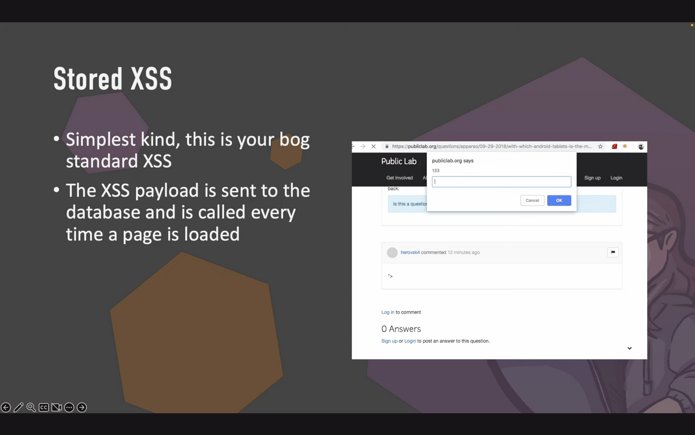
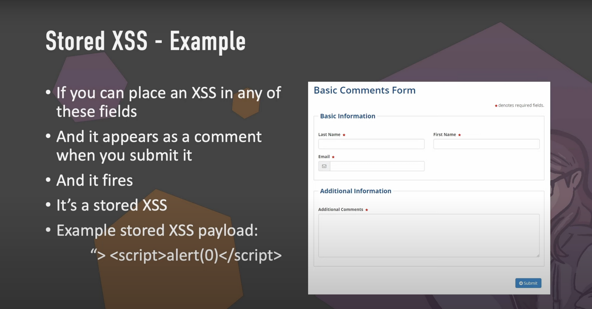
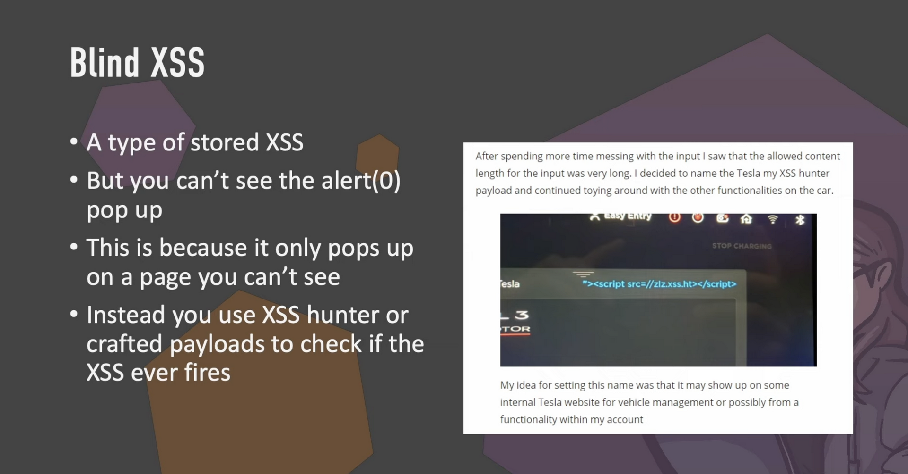
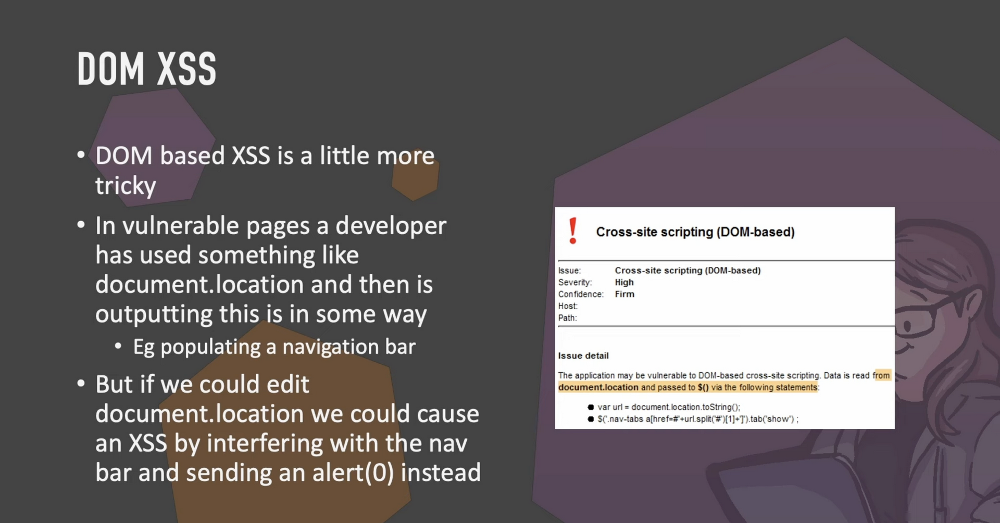
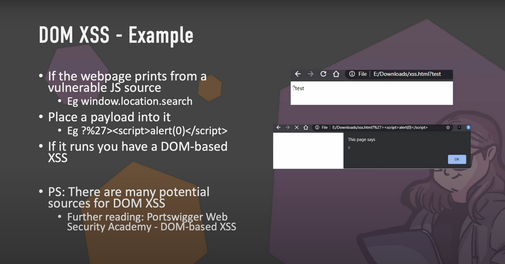
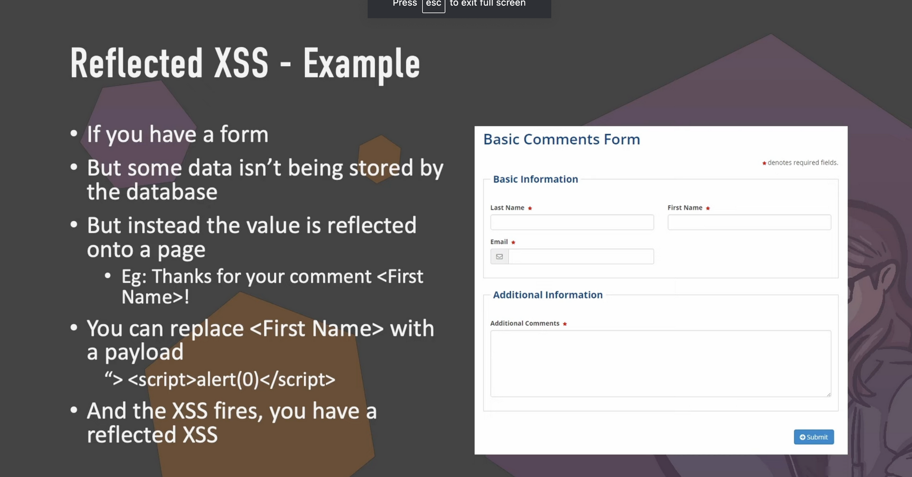
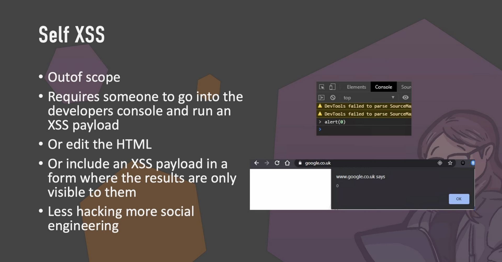
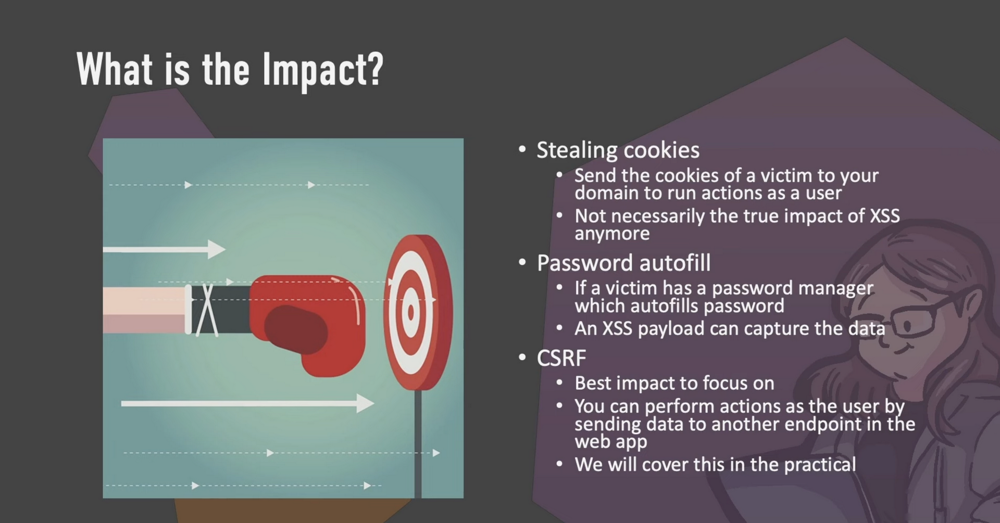

# XSS (Cross-Site Scripting)

## Stored XSS

  


## Blind XSS



you can use this tool: [XSS Hunter Express](https://github.com/mandatoryprogrammer/xsshunter-express)

## DOM XSS

  


DOM-based XSS targets a web page’s DOM directly: it attacks the client’s local copy of the web page instead of going through the server.

Attackers are able to attack the DOM when a page takes user-supplied data and dynamically alters the DOM based on that input. JavaScript libraries like jQuery are prone to DOM-based XSS since they dynamically alter DOM elements.

Unlike reflected XSS, a DOM-based XSS script doesn’t  
require server involvement, because it executes when user input modifies the source code of the page in the browser directly. The XSS script is never sent to the server, so the HTTP response from the server won’t change.

## Reflected XSS

  


## Self XSS



## Impacts



## Countermeasures


To prevent XSS, an application should implement two controls: **input validation** and **output escaping**.

Escaping means encoding special characters so that  
they are interpreted literally instead of as a special character by the programs.

For example, the left and right angle brackets can be encoded into HTML characters &lt and &gt.

To prevent **DOM XSS**, applications should avoid code that rewrites the HTML document based on user input, and the application should implement client side input validation before it is inserted into the DOM.

<https://cheatsheetseries.owasp.org/cheatsheets/Cross_Site_Scripting_Prevention_Cheat_Sheet.html>

## X-XSS-Protection HTTP header

The X-XSS-Protection HTTP header is a security feature that helps to mitigate the risk of cross-site scripting (XSS) attacks in web applications. XSS attacks occur when an attacker injects malicious scripts into web pages that are viewed by other users. The X-XSS-Protection header allows web developers to enable or disable the built-in XSS protection mechanisms provided by modern web browsers.

Here's how the X-XSS-Protection header works:

When a web browser receives a response from a server, it checks for the presence of the X-XSS-Protection header.

If the header is present and set to a specific value, the browser's XSS filter is activated.

The XSS filter analyzes the content of the web page for potential XSS attacks.

If the filter detects suspicious scripts, it may either sanitize the content by removing the malicious script or block the entire page from rendering.

If the X-XSS-Protection header is not present or is set to a specific value indicating that the filter should be disabled, the browser won't perform XSS filtering.

Example of setting the X-XSS-Protection header in an HTTP response:

```
HTTP/1.1 200 OK
Content-Type: text/html; charset=utf-8
X-XSS-Protection: 1; mode=block
```

**Explanation of the example:**

X-XSS-Protection: 1; mode=block: This header enables the XSS filter (1) and instructs the browser to block the rendering of the page if a potential XSS attack is detected (mode=block).

mode=block is a commo
n value used to ensure that the browser takes strict action when it encounters a suspected XSS attack.

Developers can also customize the X-XSS-Protection header based on their security requirements. For example:

X-XSS-Protection: 1; report=<https://example.com/report-xss> would enable the filter and send a report to the specified URL when a potential XSS attack is detected.

X-XSS-Protection: 0 would disable the XSS filter.

It's important to note that while the X-XSS-Protection header provides an additional layer of defense, developers should not solely rely on it for preventing XSS attacks. Secure coding practices, input validation, and other security measures are essential components of a comprehensive security strategy.

## HttpOnly flag

If the session cookie has the **HttpOnly** flag set, JavaScript will not be able to read the **cookie**.

## XSS Hunter Express

An easy-to-setup version of XSS Hunter. Sets up in five minutes and requires no maintenance!  
<https://github.com/mandatoryprogrammer/xsshunter-express>

## XSS Payloads

<https://github.com/nettitude/xss_payloads>  
<https://github.com/payloadbox/xss-payload-list>

### Polyglot

An XSS polyglot is a string of text which can escape attributes, tags and bypass filters all in one.

```
jaVasCript:/*-/*`/*\`/*'/*"/**/(/* */onerror=alert('THM') )//%0D%0A%0d%0a//</stYle/</titLe/</teXtarEa/</scRipt/--!>\x3csVg/<sVg/oNloAd=alert('THM')//>\x3e
```
