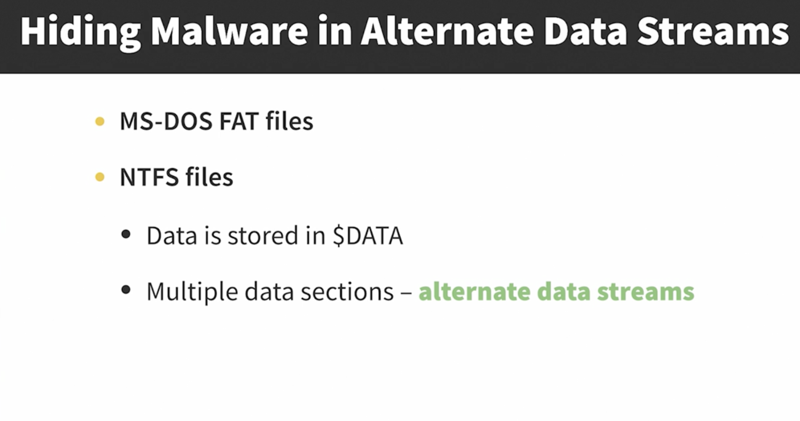
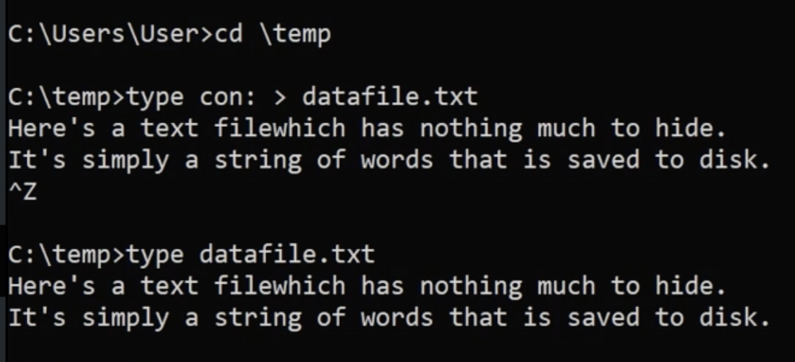
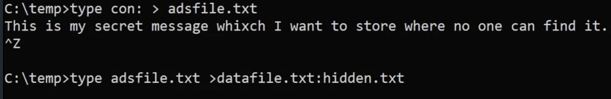

# Alternate Data Streams



Alternate Data Streams (ADS) is a feature of the **NTFS** file system in Windows that allows a file to contain multiple streams of data. Each stream has a name and the primary data stream is unnamed.

By storing data in an ADS, the content becomes less visible because typical file browsing and searching operations do not reveal the existence of ADSs.

## example

this is a demonstration of hiding a file in alternate data streams.
first, we create a `datafile.txt` file:



then, we create another file called `adsfile.txt`. the second command takes the content of adsfile.txt and writes it into an Alternate Data Stream (ADS) named hidden.txt attached to the file `datafile.txt`.



now when you open datafile.txt, there is no specific change to be recognized.


to retrieve the hidden message from the ADS, you would use the following command:

```shell
more < datafile.txt:hidden.txt
```
