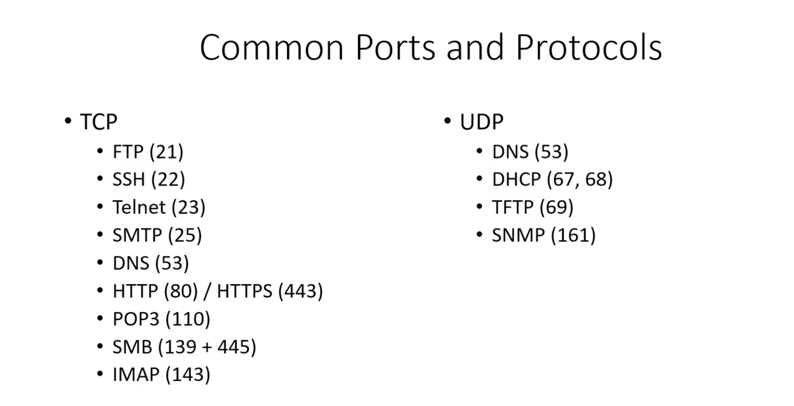

# Common Ports & Protocols

## SMTP, POP3, IMAP

all relates to mail

## Telnet vs SSH

ssh is the encrypted version of telnet.

## SMB

for file sharing
as a pentester, you're gonna see this alot.

## DNS

is both tcp and udp protocol.
