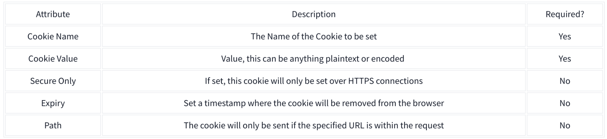

# Cookies and Sessions

Most websites use cookies to communicate session information in HTTP requests. HTTP cookies are small pieces of data that web servers send to your browser.

When you log in to a site, the server creates a session for you and sends the session ID to your browser as a cookie. After receiving a cookie, your browser stores it and includes it in every request to the same server.

That’s how the server knows it’s you! After the cookie for the session is generated, the server will track it and use it to validate your identity.

## Cookies attributes

