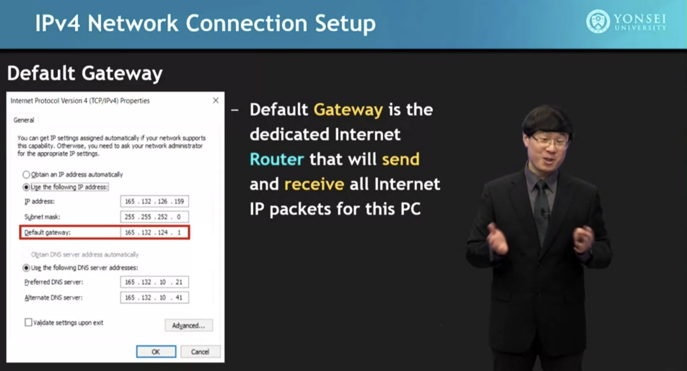
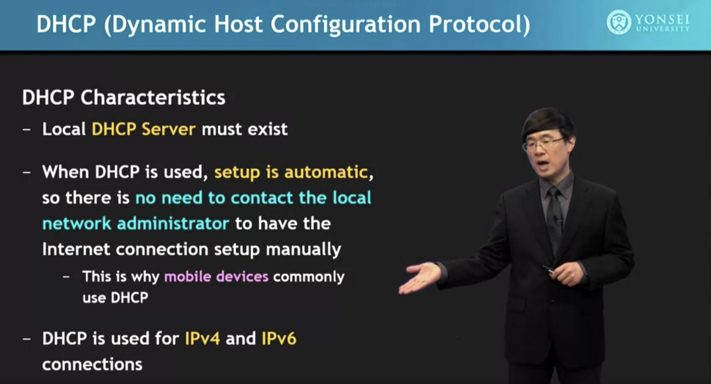
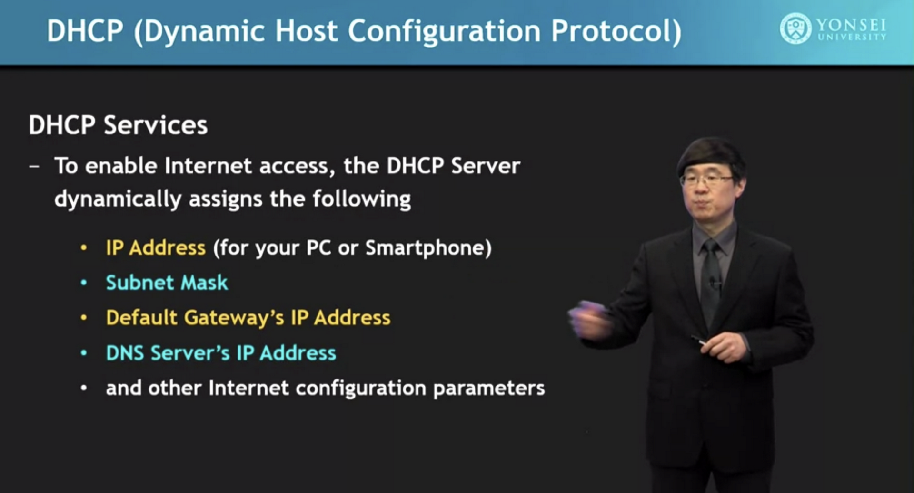
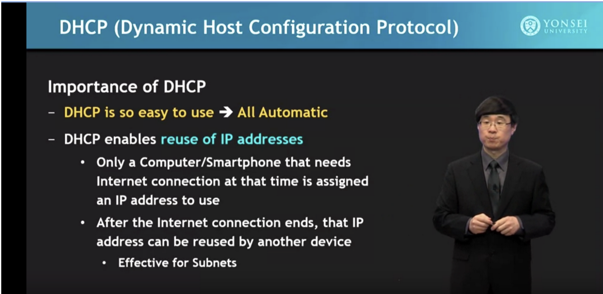
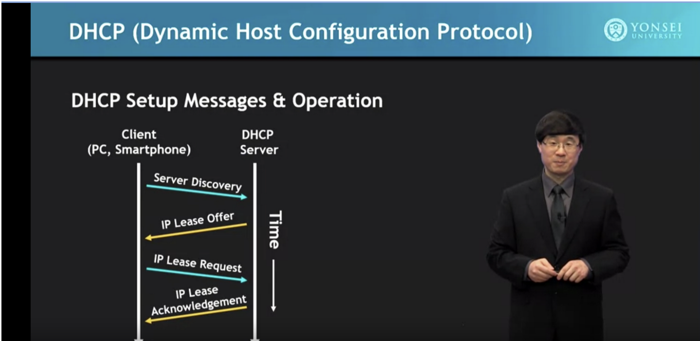
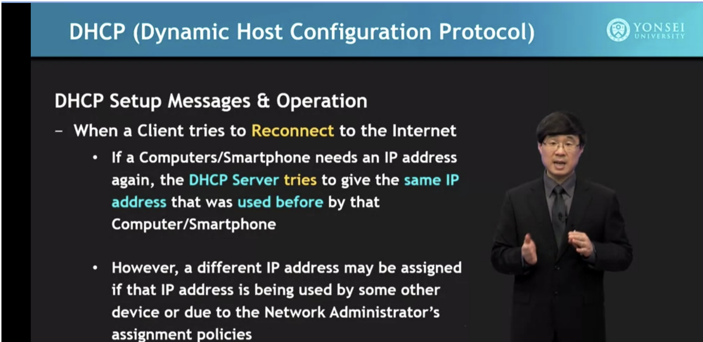

# DHCP

DHCP stands for Dynamic Host Configuration Protocol, and it is responsible for assigning an IP address to the systems that try to connect to a network. One analogy of the DHCP request would be when you enter a fancy restaurant, and the waiter welcomes you and guides you to an empty table.

Know that DHCP has automatically provided your device with the network settings whenever you can join a network without manual configuration.

**Note:** By inspecting DHCP transactions, we can learn about the devices that joined the network.

## Description

