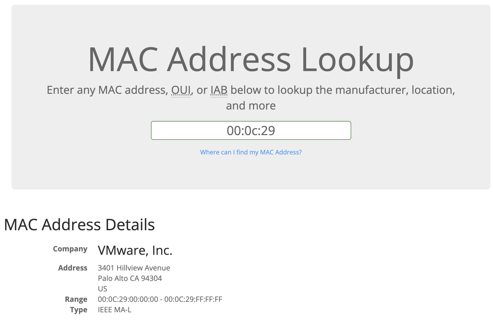

# MAC Address

## Description

mac address is in layer 2.

The first three pairs of a mac address are identifiers.

Example:
Mac: ether 00:0c:29:0a: 42:05

we can use this trick to identify connected devices.
