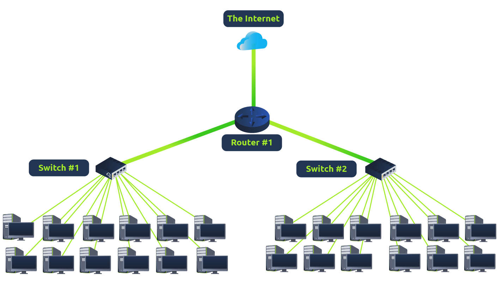
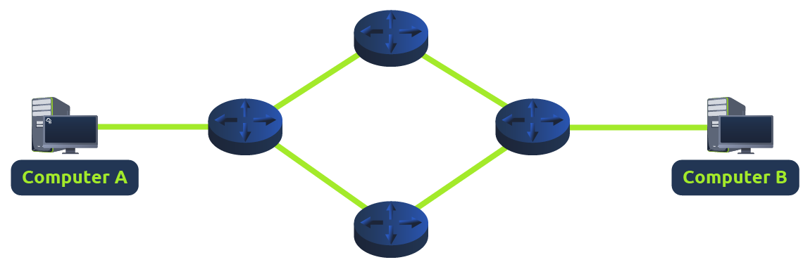

# Switch

Switches are dedicated devices within a network that are designed to aggregate multiple other devices such as computers, printers, or any other networking-capable device using ethernet. These various devices plug into a switch's port. Switches are usually found in larger networks such as businesses, schools, or similar-sized networks, where there are many devices to connect to the network. Switches can connect a large number of devices by having ports of 4, 8, 16, 24, 32, and 64 for devices to plug into.

Switches are much more efficient than their lesser counterpart (hubs/repeaters). Switches keep track of what device is connected to which port. This way, when they receive a packet, instead of repeating that packet to every port like a hub would do, it just sends it to the intended target, thus reducing network traffic.

Both Switches and Routers can be connected to one another. The ability to do this increases the redundancy (the reliability) of a network by adding multiple paths for data to take. If one path goes down, another can be used. Whilst this may reduce the overall performance of a network because packets have to take longer to travel, there is no downtime -- a small price to pay considering the alternative.

# Router

It's a router's job to connect networks and pass data between them. It does this by using routing (hence the name router!).

Routing is the label given to the process of data travelling across networks. Routing involves creating a path between networks so that this data can be successfully delivered.

Routing is useful when devices are connected by many paths, such as in the example diagram below.

