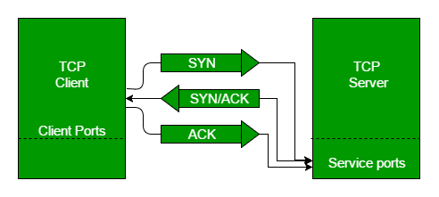

# TCP, UDP, and 3-Way Handshake

## TCP vs UDP

## TCP 3-Way Handshake Process

This could also be seen as a way of how TCP connection is established. Before getting into the details, let us look at some basics. TCP stands for Transmission Control Protocol which indicates that it does something to control the transmission of the data in a reliable way.

The process of communication between devices over the internet happens according to the current TCP/IP suite model(stripped out version of OSI reference model). The Application layer is a top pile of a stack of TCP/IP models from where network referenced applications like web browsers on the client-side establish a connection with the server. From the application layer, the information is transferred to the transport layer where our topic comes into the picture. The two important protocols of this layer are – TCP, UDP(User Datagram Protocol) out of which TCP is prevalent(since it provides reliability for the connection established). However, you can find an application of UDP in querying the DNS server to get the binary equivalent of the Domain Name used for the website.

- Step 1 (SYN): In the first step, the client wants to establish a connection with a server, so it sends a segment with SYN(Synchronize Sequence Number) which informs the server that the client is likely to start communication and with what sequence number it starts segments with
- Step 2 (SYN + ACK): Server responds to the client request with SYN-ACK signal bits set. Acknowledgement(ACK) signifies the response of the segment it received and SYN signifies with what sequence number it is likely to start the segments with
- Step 3 (ACK): In the final part client acknowledges the response of the server and they both establish a reliable connection with which they will start the actual data transfer
