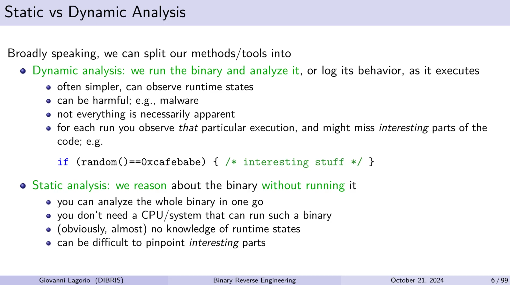
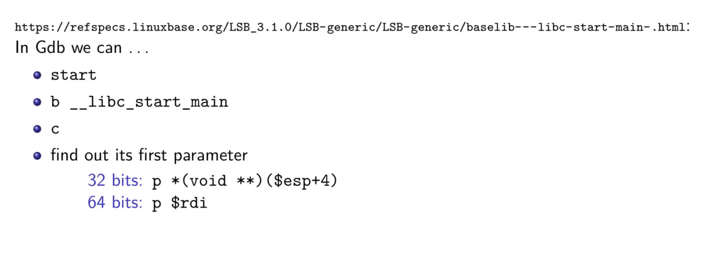
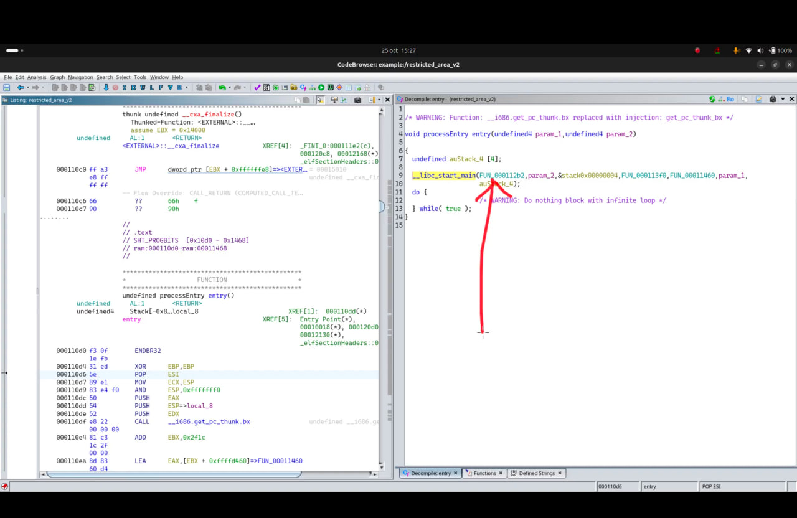
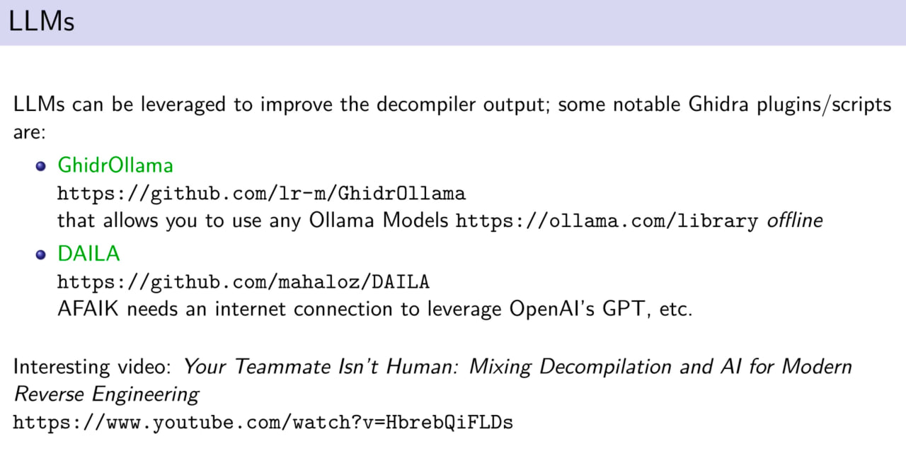

# Reverse Engineering



Static is with tools such as `objdump` and you don't even need to run the binary.

Dynamic is with tools like gdb, and etc.

**example**:

```shell
gdb ./toppler32

(gdb) break main
(gdb) run
(gdb) si  # Single step one instruction(the same as stepi command)
(gdb) si  # Continue stepping instruction-by-instruction
```

## Sections in Binary Files

binary files have sections like .text and .data; typically, .text holds code, and .data holds data. However, data can also be hidden in the code section.

## Functions Executed Before Main in an Executable Binary

In an executable binary, certain functions run before the `main` function to set up the program's environment. These functions are part of the *runtime initialization* process and handle critical setup tasks such as memory allocation, preparing global variables, and linking dynamic libraries. Here are some key elements involved:

1. **`_start` Function**: This is the true entry point of the program. When the operating system loads an executable, it initially jumps to `_start`, not `main`. `_start` sets up the necessary environment and eventually calls `main`.

2. **Dynamic Linker/Loader**: If the program relies on shared libraries, the dynamic linker/loader (`ld.so` on Linux) resolves all the dynamic symbols and dependencies before `main` is called.

3. **Constructor Functions**: Some functions marked as *constructors* (often specified with `__attribute__((constructor))` in C) run before `main`. These are typically used for initializing global objects or settings.

4. **Static Initializers**: Variables with static storage duration, especially those in C++, may have initialization functions that run before `main` to set up global or static objects.

5. **C Runtime (CRT) Initialization**: The C runtime library (CRT) sets up things like standard input/output and handles other necessary low-level tasks before calling `main`.

## Ghidra

Ghidra is a free and open source reverse engineering tool developed by the National Security Agency of the United States.

[Link](https://github.com/NationalSecurityAgency/ghidra)

### Tips

- Add the the **reference count** column on defined strings window in ghidra. knowing the reference number of each function and variable you may find some clues. if something is referenced a lot, there's probably something about it.
- Add the **defined strings** window. searching in strings can prove to be useful.
- add the **functions** window.

## How to find the main function

### Linux

first parameter of __libc_start_main function is the address of main.

we can use this trick to find main when the file is stripped.

**Gdb**:


**Ghidra**:


## Using LLMs



## Sources

Binary Analysis and Secure Coding Course - University of Genoa by [Giovanni Lagorio](https://github.com/zxgio)

[videos](https://www.youtube.com/playlist?list=PLq7uXU-bjtDIxE-LVHzc5ejik9X6Sf9oE)
