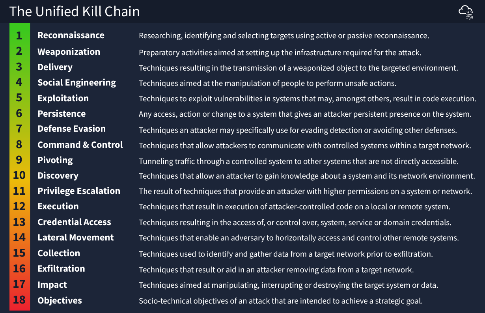

# Cyber Kill Chain

The Cyber Kill Chain is a framework developed by Lockheed Martin to identify and prevent cyber attacks. It outlines the stages of a cyber attack and helps organizations understand how to defend against them. Here are the seven stages:

1. **Reconnaissance**: Attackers gather information about the target, such as identifying network vulnerabilities and user behavior.

2. **Weaponization**: Attackers create malicious software (malware) tailored to exploit the identified vulnerabilities.

3. **Delivery**: The malware is transmitted to the target system, often through phishing emails, malicious websites, or infected USB drives.

4. **Exploitation**: The malware is executed on the target system by exploiting a vulnerability.

5. **Installation**: The malware installs a backdoor or other persistent method to maintain access to the target system.

6. **Command and Control (C2)**: The attacker establishes a channel of communication with the compromised system to control it remotely.

7. **Actions on Objectives**: The attacker achieves their goals, which could include data theft, system disruption, or espionage.

## Unified Kill Chain

The Unified Kill Chain published in 2017, aims to complement (not compete) with other cybersecurity kill chain frameworks such as Lockheed Martin’s and MITRE’s ATT&CK.

The UKC states that there are 18 phases to an attack: Everything from reconnaissance to data exfiltration and understanding an attacker's motive.

Some large benefits of the UKC over traditional cybersecurity kill chain frameworks include the fact that it is modern and extremely detailed (reminder: it has 18 phases officially, whereas other frameworks may have a small handful)

