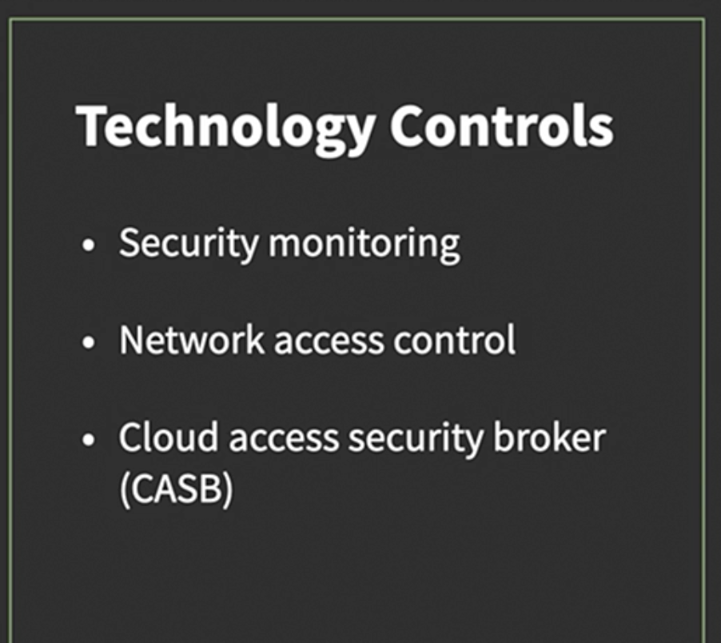

# Shadow IT

Shadow IT refers to information technology (IT) systems, software, and services used within an organization without explicit approval or knowledge of the IT department. Employees often engage in shadow IT to quickly meet their needs, using tools that the official IT department has not sanctioned. This practice can enhance productivity but also poses significant risks, including security vulnerabilities, data breaches, and compliance issues.

We can avoid it using the following meatures:

