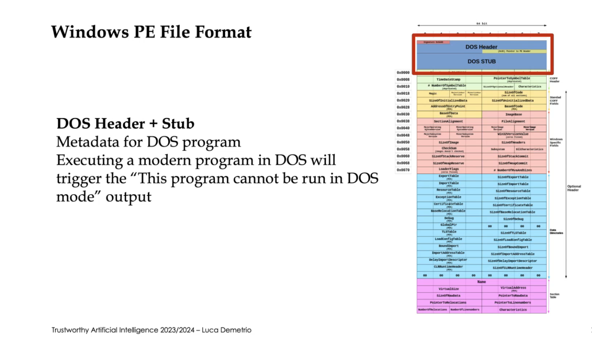
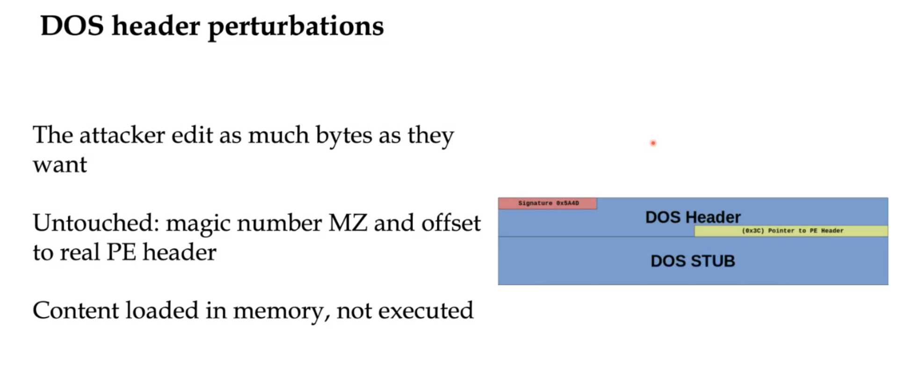
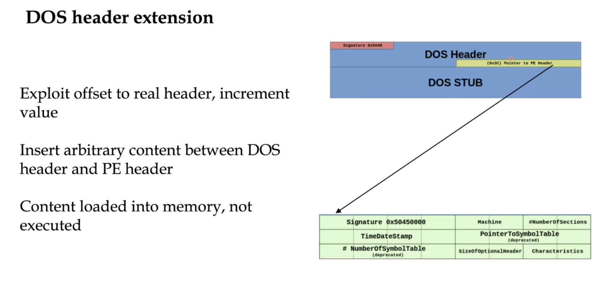
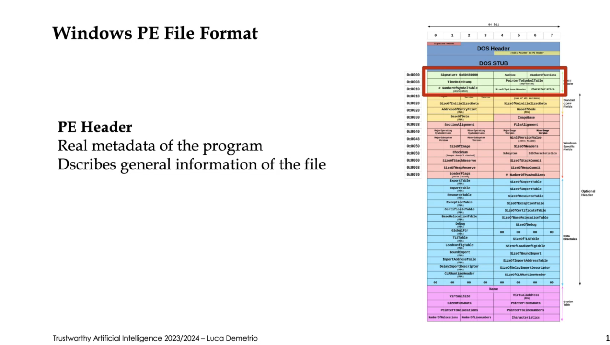
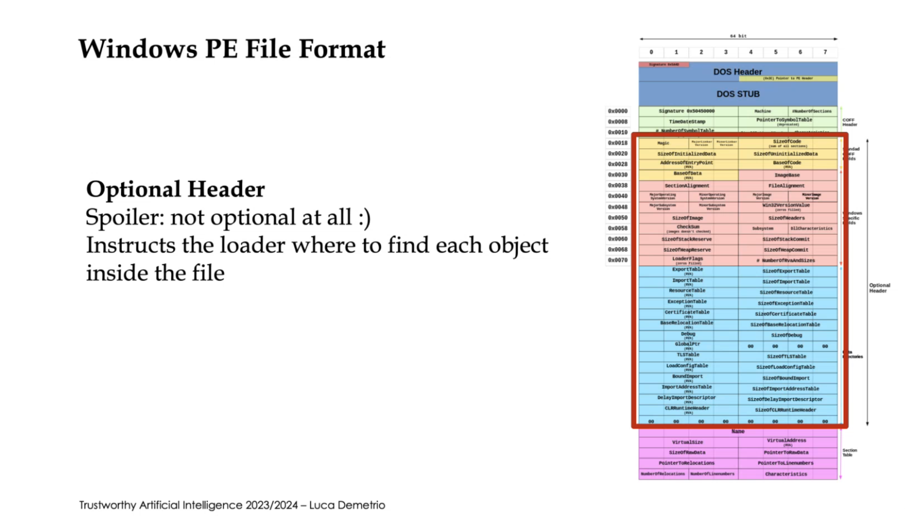
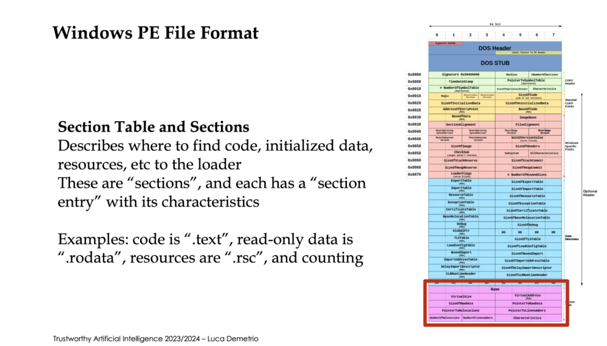
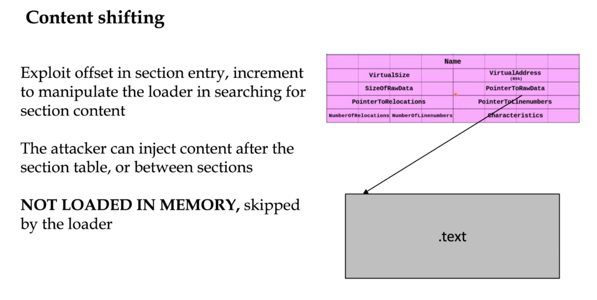
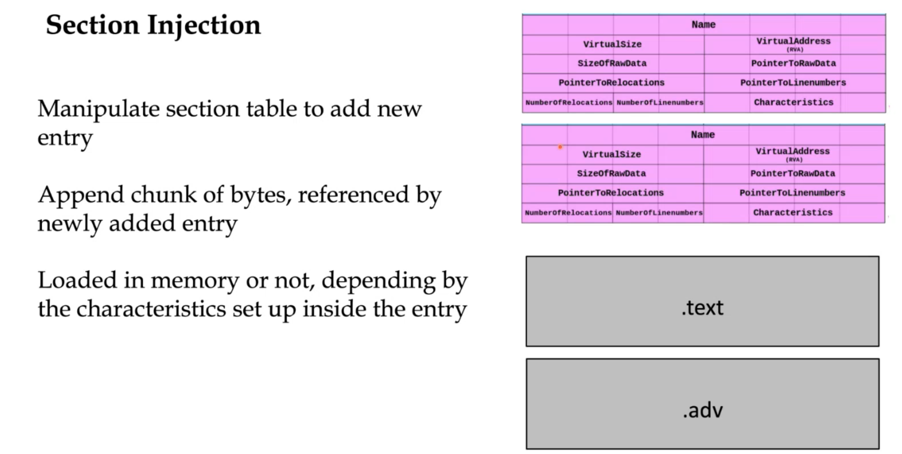
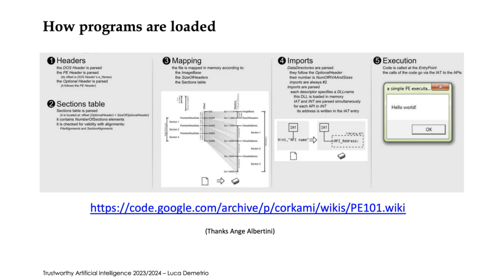

# Windows PE File Format

## DOS Header + Stub

This is useless to be honest, but it can be manipulated. in the following picture, blue area can be manipulated but it's not executable because it's not defined as it. 

We can exploit the offset to real header and create extra space for our content! notice the gap in the picture between dos header and PE header.

## PE Header

## Optional Header

## Section Table and Sections

we can exploit it:

you can even add your own section!

## How programs are loaded

