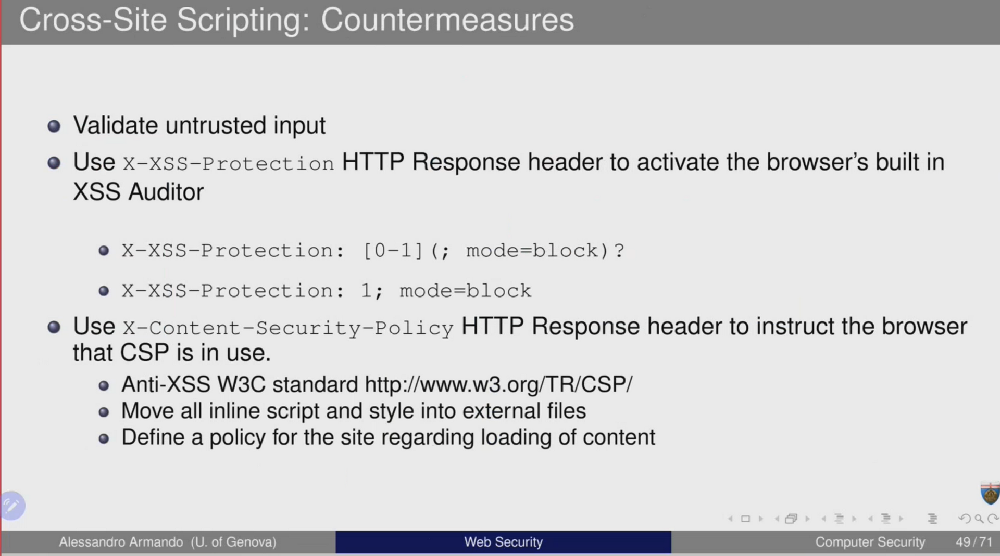

# XSS (Cross-Site Scripting)

## Countermeasures



## X-XSS-Protection HTTP header

The X-XSS-Protection HTTP header is a security feature that helps to mitigate the risk of cross-site scripting (XSS) attacks in web applications. XSS attacks occur when an attacker injects malicious scripts into web pages that are viewed by other users. The X-XSS-Protection header allows web developers to enable or disable the built-in XSS protection mechanisms provided by modern web browsers.

Here's how the X-XSS-Protection header works:

When a web browser receives a response from a server, it checks for the presence of the X-XSS-Protection header.

If the header is present and set to a specific value, the browser's XSS filter is activated.

The XSS filter analyzes the content of the web page for potential XSS attacks.

If the filter detects suspicious scripts, it may either sanitize the content by removing the malicious script or block the entire page from rendering.

If the X-XSS-Protection header is not present or is set to a specific value indicating that the filter should be disabled, the browser won't perform XSS filtering.

Example of setting the X-XSS-Protection header in an HTTP response:

```
HTTP/1.1 200 OK
Content-Type: text/html; charset=utf-8
X-XSS-Protection: 1; mode=block
```

Explanation of the example:

X-XSS-Protection: 1; mode=block: This header enables the XSS filter (1) and instructs the browser to block the rendering of the page if a potential XSS attack is detected (mode=block).

mode=block is a common value used to ensure that the browser takes strict action when it encounters a suspected XSS attack.

Developers can also customize the X-XSS-Protection header based on their security requirements. For example:

X-XSS-Protection: 1; report=<https://example.com/report-xss> would enable the filter and send a report to the specified URL when a potential XSS attack is detected.

X-XSS-Protection: 0 would disable the XSS filter.

It's important to note that while the X-XSS-Protection header provides an additional layer of defense, developers should not solely rely on it for preventing XSS attacks. Secure coding practices, input validation, and other security measures are essential components of a comprehensive security strategy.

User
