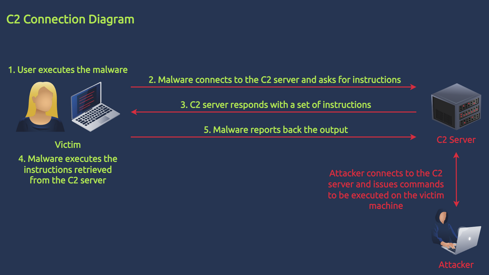

# Command and Control (C2)

C2, or command and control, refers to a centralised system or infrastructure that malicious actors use to remotely manage and control compromised devices or systems. It serves as a channel through which attackers issue commands to compromised entities, enabling them to carry out various activities, such as data theft, surveillance, or further malware propagation.

Malware with C2 capabilities typically exhibits the following behaviours:

- HTTP requests: C2 servers often communicate with compromised assets using HTTP(s) requests. These requests can be used to send commands or receive data.
- Command execution: This behaviour is the most common, allowing attackers to execute OS commands inside the machine.
- Sleep or delay: To evade detection and maintain stealth, threat actors typically instruct the running malware to enter a sleep or delay for a specific period. During this time, the malware won't do anything; it will only connect back to the C2 server once the timer completes.