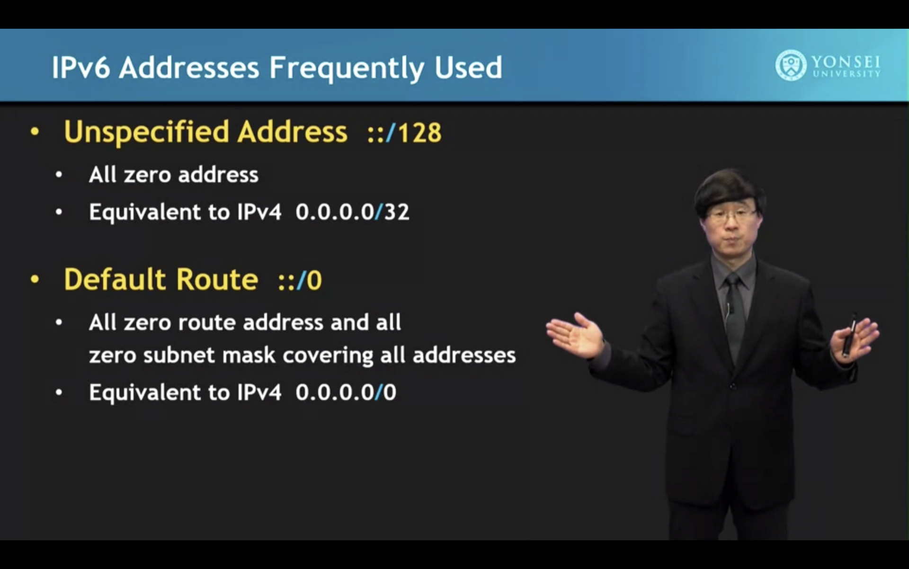

# IP Address

## Description

The whole IP address concept is in layer 3 and about routing.

we have ipv4 and ipv6. ipv4 gives us a limited amount of ips that we can use but it's less than human populations so we come up with ipv6. however, everyone nowadays is still using ipv4. How? using NAT.

## ipv6

## Private IP

## NAT

NAT (Network Address Translation) changes the source and destination IP addresses and ports. Address translation reduces the need for IPv4 public addresses and hides private network address ranges. Routers or firewalls usually do this process.

An example will help you understand the concept:

Host A requests a web page from an Internet server. Because Host A uses private IP addressing, the source address of the request has to be changed by the router because private IP addresses are not routable on the Internet. Router R1 receives the request, changes the source IP address to its public IP address, and sends the packet to server S1. Server S1 receives the packet and replies to router R1. Router R1 receives the packet, changes the destination IP addresses to the private IP address of Host A, and sends the packet to Host A.

There are three types of address translation:

1. Static NAT – translates one private IP address to a public one. The public IP address is always the same.
2. Dynamic NAT – private IP addresses are mapped to the pool of public IP addresses.
3. Port Address Translation (PAT) – one public IP address is used for all internal devices, but a different port is assigned to each private IP address. Also known as NAT Overload.
