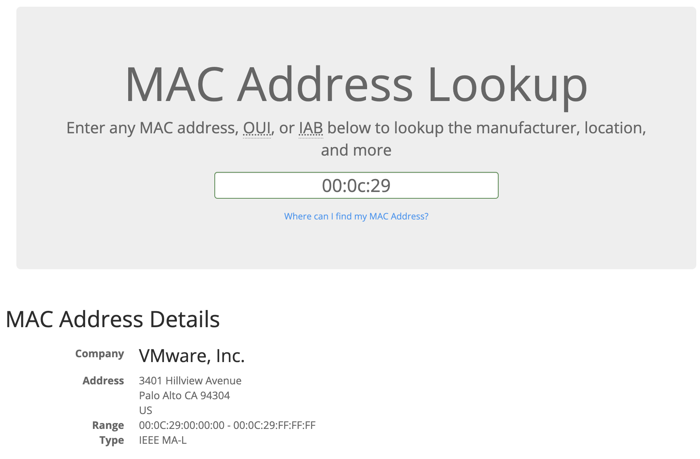

# MAC Address

Devices on a network will all have a physical network interface, which is a microchip board found on the device's motherboard. This network interface is assigned a unique address at the factory it was built at, called a MAC (Media Access Control ) address. The MAC address is a twelve-character hexadecimal number.

The first six characters represent the company that made the network interface, and the last six is a unique number.

**Example:**
Mac: ether 00:0c:29:0a: 42:05

we can use this trick to identify connected devices.
