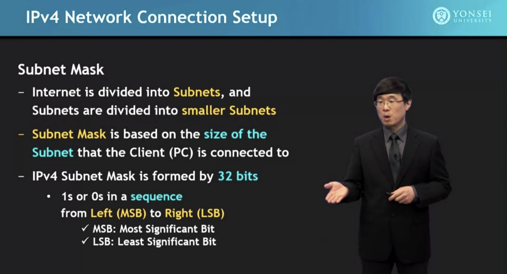
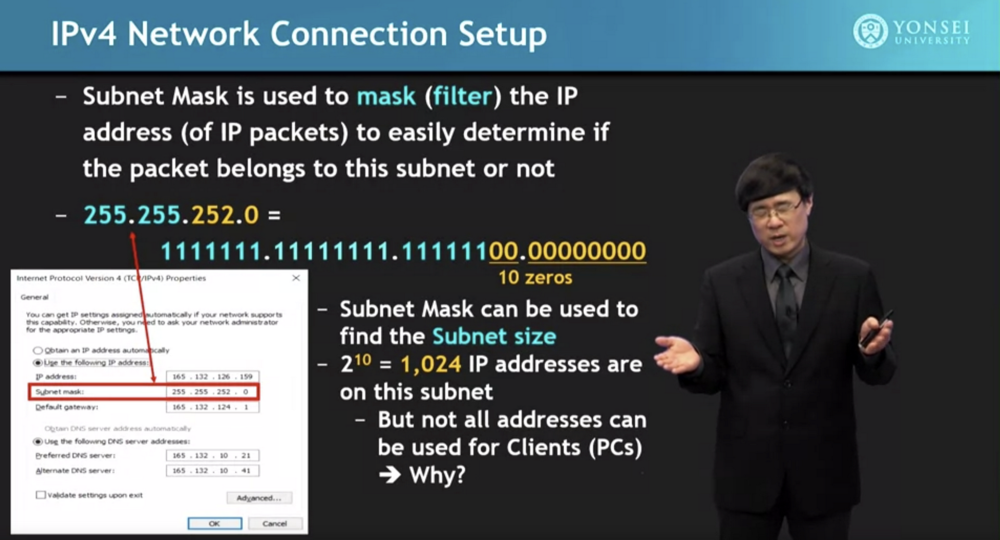
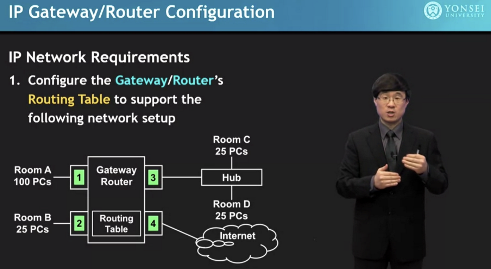
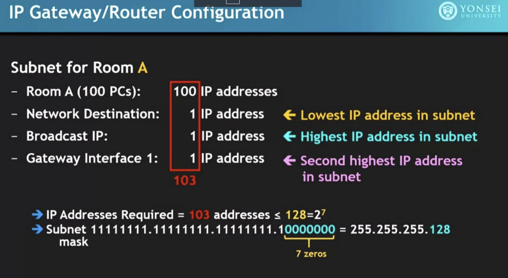
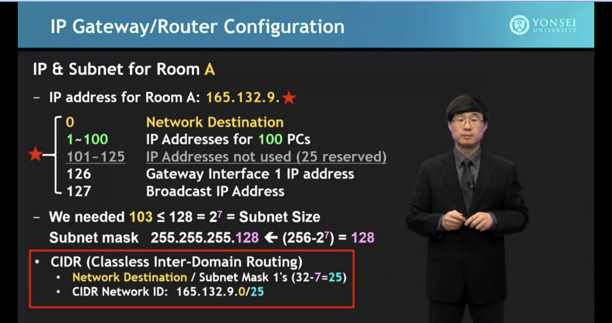
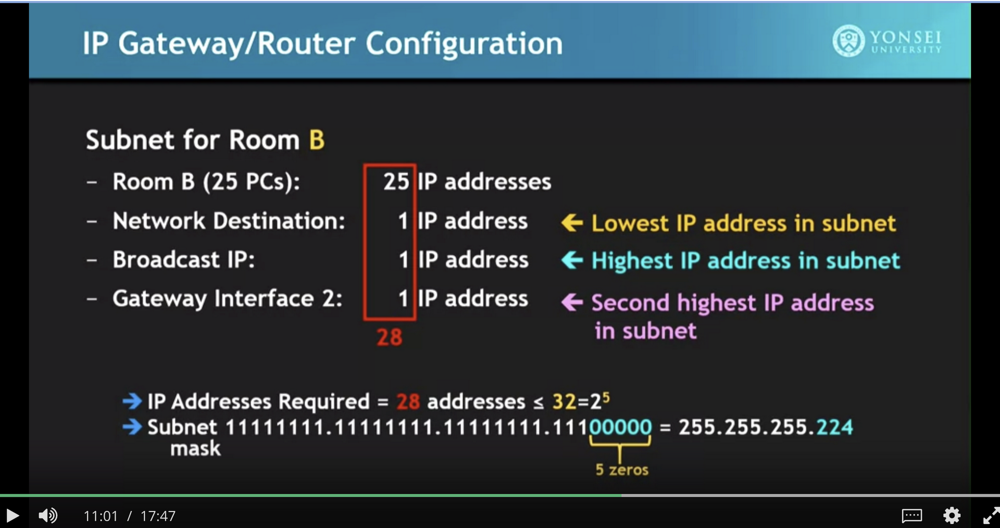
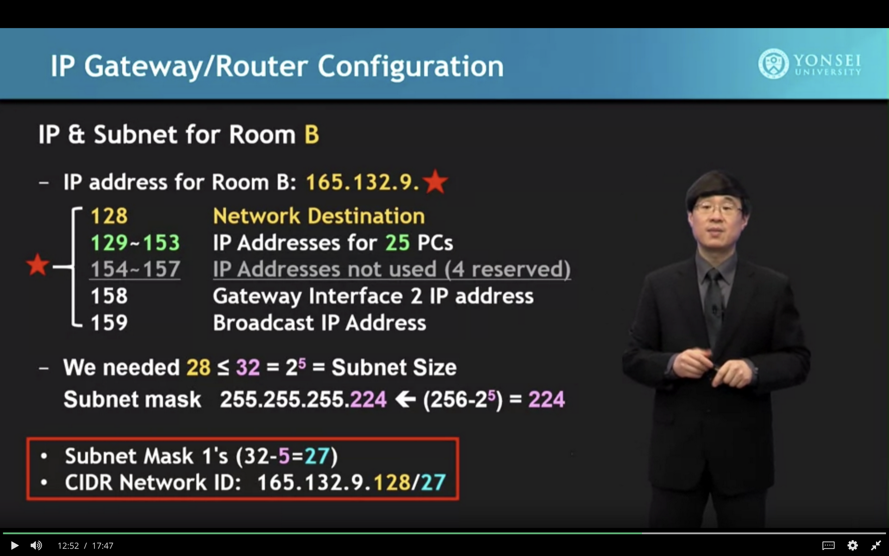
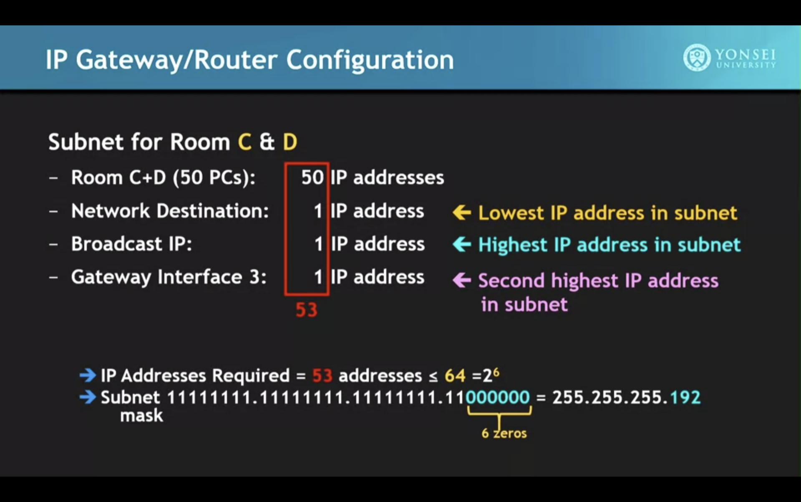
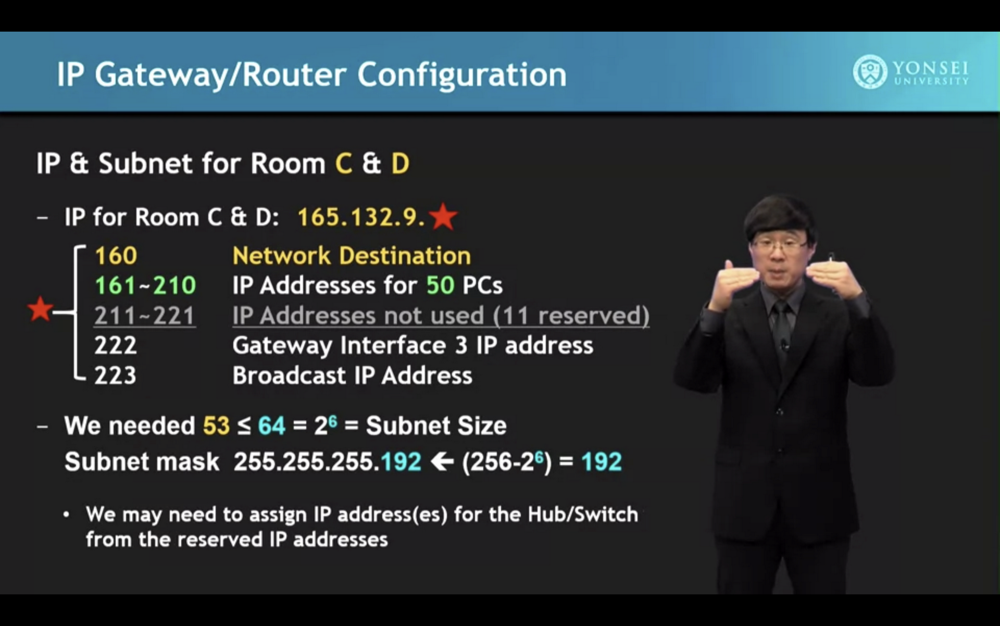

# Subnetting

## Description

tip: subnet mask is also called netmask.

## Example

tip: notice the CIDR definition.

## Guides

[Subnet-Guide.xlsx](../../../_resources/Subnet-Guide.xlsx)

<https://www.ipaddressguide.com/cidr>

<https://www.youtube.com/watch?v=ZxAwQB8TZsM>
