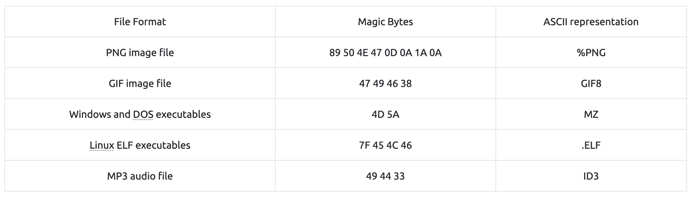

# Magic Bytes

File signatures, commonly referred to as "magic bytes", are specific byte sequences at the beginning of a file that identify or verify its content type and format. These bytes often have corresponding ASCII characters, allowing for easier human readability when inspected. The identification process helps software applications quickly determine whether a file is in a format they can handle, aiding operational functionality and security measures.

In cyber security, file signatures are crucial for identifying file types and formats. You'll encounter them in malware analysis, incident response, network traffic inspection, web security checks, and forensics. Knowing how to work with these magic bytes can help you quickly identify malicious or suspicious activity and choose the right tools for deeper analysis.

Here is a list of some of the most common files and their magic:  

